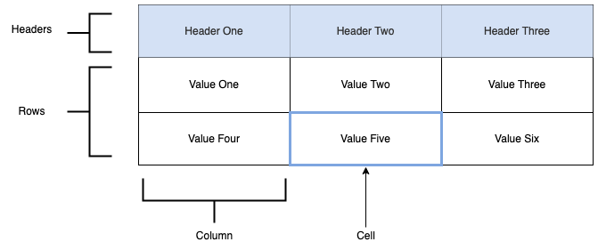

# Csv.Core

A simple .Net Core class library for reading, manipulating, and writing CSV-formatted data.

## Overview

Read CSV data from a file or `Stream` with the `CsvReader` class or create a new instance with the `CsvFactory` (`CsvFactory.New`).

Examine and manipulate CSV data in memory with the `ICsv` interface.

Write the contents of an `ICsv` interface to a file or `Stream` with the `CsvWriter` class.

## Structure

The structure of this library follows the structure of a typical table, as seen below.



The `ICsv` interface contains properties for each of these elements, named appropriately:

  * Headers --> `ICsvHeader`
  * Rows --> `ICsvRow`
  * Columns --> `ICsvColumn`
  * Cells --> `ICsvCell`

### The Interface
The main component of this library is the `ICsv` interface.

```
public interface ICsv
{
    string Filename { get; set; }
    bool HasHeaders { get; }
    char Separator { get; set; }
    int NumRows { get; }
    int NumColumns { get; }

    ICsvHeader[] Headers { get; set; }
    ICsvRow[] Rows { get; }
    ICsvColumn[] Columns { get; }
    ICsvCell[][] Cells { get; } // uses row/column indexing
    ICsvCell GetCell(int row, int column);
    void SetCell(int row, int column, object value); // will create rows and/or columns as needed
}
```


## Usage

### Reading

There are two methods of reading data into an `ICsv` instance: from a file or from a `Stream` object - Each method contains an `async` and a synchronous version.

Every read method contains two optional parameters:

  * `bool hasHeaders = true`
    * With this flag set to `true`, the first line of data will be parsed as a set of `ICsvHeader` elements
    * If this flag is set to `false`, the first line of data will be treated as the first row and no headers will be created
  * `char separator = ','`
    * This value indicates the character used to separate "cells" in the CSV data
    * Change this value if you use something other than a comma

#### File


To read a CSV-formatted file:

```
ICsv csv = CsvReader.FromFile("/path/to/file.csv");
```

OR

```
ICsv csv = await CsvReader.FromFileAsync("/path/to/file.csv");
```

#### Stream

To read CSV-formatted data from a `Stream`:

```
Stream stream = GetStream();
ICsv csv = CsvReader.FromStream(stream);
```

OR

```
Stream stream = GetStream();
ICsv csv = await CsvReader.FromStreamAsync(stream);
```

### Writing
Once you have an `ICsv` instance, you can use the `CsvWriter` class to write the CSV-formatted data to a file or `Stream`.

Both methods contain an `async` version as well as a synchronous version.

#### File
To write an `ICsv` instance to file:

```
ICsv csv = MakeACsv();
CsvWriter.ToFile(csv, "/path/to/file.csv");
```

OR

```
ICsv csv = MakeACsv();
await CsvWriter.ToFileAsync(csv, "/path/to/file.csv");
```

#### Stream
To write an `ICsv` instance to a `Stream`:

```
ICsv csv = MakeACsv();
Stream stream = GetStream();
CsvWriter.ToStream(csv, stream);
```

OR

```
ICsv csv = MakeACsv();
Stream stream = GetStream();
await CsvWriter.ToStreamAsync(csv, stream);
```

## Future Objectives
My hope is to keep this library simple and easy to use while providing useful features, which means it is open for improvements.

Some ideas for possible improvements include:
  * Templating the `ICsv` interface to easily map between CSV data and user-defined C# classes

# Known Bugs
There are no currently identified issues.